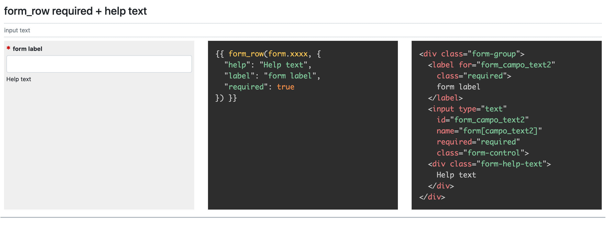

# Symfony Bootstrap 4 Form Theme

A Bootstrap 4 Form Theme for Symfony 3.x and 4.x.

## Summary

* Select elements have `custom-select` (<https://getbootstrap.com/docs/4.3/components/forms/#select-menu>) by default, this behaviour can be changed using the new `config` parameter of `form_row` 
* A new `help` parameter to add custom help text has been added. It adds a `div.form-help-text` element containing the help string (HTML can be used). The `form-help-text` class is defined in `_forms.scss`.


# Use of the form theme

* Add the `/Resources/public/test_form/_forms.scss` file to your css (after Bootstrap css). Change default options if necessary
* Place the `/Resources/views/form/bs4_form_layout.html.twig` in your *view* folder (in this test app it is located in the `form` subdir)
* Modify your `/app/config/config.yml` file and add

```yaml
# Twig Configuration
twig:
  form_themes:
    - '/form/bs4_form_layout.html.twig'
```


# Use of the test Symfony application

You can clone the test app repository and run the form test app.
Clone the repo and run composer to install Symfony. Run npm in the public directory to install Bootstrap, if you need to test your changes.

The form test page url will be: `<your_test_domain>/test-form'.
The css and js directory is `/web/assets`.

* twig: `src/AppBundle/Resources/views/test_form/test_form.html.twig`
* controller: `src/AppBundle/Controller/TestFormController.php`

The test page gives you detailed informations about all form widgets:




## Reference:
* https://symfony.com/doc/3.4/form/form_themes.html
* https://symfony.com/doc/3.4/forms.html
* https://symfony.com/doc/current/reference/forms/types.html
* https://symfony.com/doc/3.4/form/rendering.html
* https://symfony.com/doc/3.4/reference/forms/twig_reference.html
* https://symfony.com/doc/3.4/form/bootstrap4.html
* https://getbootstrap.com/docs/4.3/components/forms/
* https://getbootstrap.com/docs/4.3/components/input-group/
* https://getbootstrap.com/docs/4.3/components/buttons/


